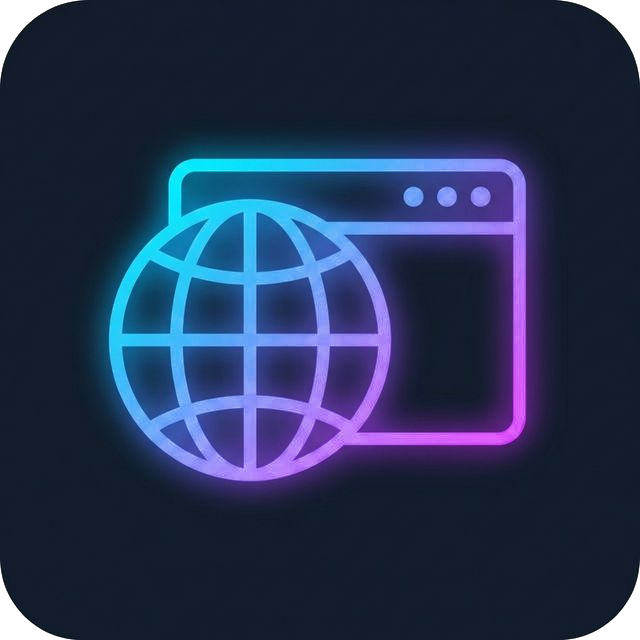

# Browser Tab

  

An embedded browser panel right inside VS Code. Stop switching windows and start previewing your workspace instantly!

## Features

- **Embedded Browser**: Open a full-featured web browser directly inside a VS Code webview panel.
- **Auto-Reload**: Automatically reloads the browser tab when a workspace file is saved.
- **HMR Awareness**: Skips full-page auto-reload for file types handled by HMR tools (Vite, webpack, etc.) like JS, TS, CSS, Vue, Svelte files, keeping your state intact.

## Commands

This extension contributes the following commands to the Command Palette:

- **`Browser Tab: Open Browser Tab`** (`vscode-browser-tab.open`): Opens the embedded browser panel. Default keybinding: `Ctrl+Shift+B` (Windows/Linux) or `Cmd+Shift+B` (macOS).
- **`Browser Tab: Open URL in Browser Tab`** (`vscode-browser-tab.navigate`): Prompts for a URL and navigates the browser panel to it. Default keybinding: `Ctrl+Shift+L` (Windows/Linux) or `Cmd+Shift+L` (macOS).

## Extension Settings

Customize the extension's behavior through the following settings:

- `vscode-browser-tab.defaultUrl`: Default URL to open when the browser tab is launched. (Default: `http://localhost:3000`)
- `vscode-browser-tab.autoReload`: Automatically reload the browser tab when a workspace file is saved. (Default: `true`)
- `vscode-browser-tab.hmrAware`: Skip full-page auto-reload for file types handled by HMR. (Default: `true`)
- `vscode-browser-tab.terminalLinks`: When enabled, clicking a URL in the terminal opens it in the Browser Tab. Disable to use the system browser instead. (Default: `true`)

## Release Notes

For a full history of changes, see the [CHANGELOG.md](CHANGELOG.md).
